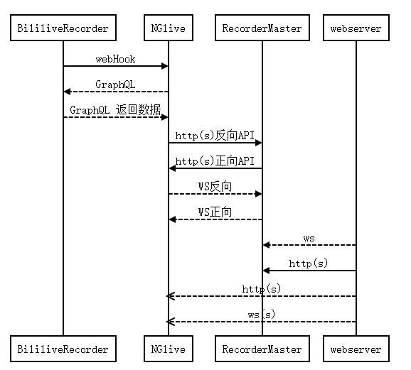

# 高度自动化的录播服务端！

## 一、项目介绍

### 1、介绍

这是NGlive的录播服务器集群的客户端部分实现代码，它可以自动化的进行录制-压制-上传-通知，同时流程高度可自定义，并且可以任意受中心服务器的调度，有一定的错误修复能力。可以保证长期稳定的运行。


### 2、基本功能
这个客户端集 录制、转码压制、上传为一体，同时集成了正向反向API、WS等功能
如下图所示：
这里应该有图、但是还没有做


### 3、环境
本项目基于**Python3.9.0**开发，**在其他版本的运行状态未知**。**请在安装依赖前阅读下面的说明** 可以有效减少出问题的概率。

### 4、依赖
|  Package  |  Version  |
|-----------|   ------  |
|baidupcs-py|    0.6.25 |
|requests   |    2.26.0 |
|fastapi    |    0.63.0 |
|pydantic   |    1.7.3  |
|pathlib    |    1.0.1  |
|SQLAlchemy |    1.3.22 |
|loguru     |    0.5.3  |
|websockets |    8.1    |

* 安装 `baidupcs-py` 时，请前往 [这里](https://github.com/PeterDing/BaiduPCS-Py) **仔细阅读安装注意事项**

### 5、项目结构
本项目结构如下：
```
├─ BililiveRecorder  录播姬
|  __GraphQL.py      封装了部分graphql方法
│  README.md         自述文件
│  LICENSE           LICENSE
│  db.py             数据库的定义和基本操作   
|  eventManager.py   事件驱动核心 
|  eventRun.py       NGlive任务管理
|  initial.py        配置文件
|  linstener.py      监听-响应模块
|  log.py            日志配置
|  orm.py            验证-整理数据
|  resquest_test.py  验证-整理数据
|  systemInfo.py     系统监控
|  taskslist.py      任务队列
|  trcode.py         转码模块
|  up.py             上传模块
|  upload.py         上传功能的实现
|  wsclient.py       ws模块
|  api.py            程序入口

```
### 6、交流
外联群QQ:781665797

# 二、使用
## 安装并配置ffmpeg
您如果用到了转码模块 需要安装并配置 ffmpeg 您需要在环境变量中配置他或者自行修改代码。
## 配置录播姬
略 请参考 [`BililiveRecorder`](https://github.com/Bililive/BililiveRecorder)的配置文档
录播姬需要配置webhook

## 配置NGlive
下载本项目后，用任意IDE打开 `config.ini`

找到以下代码片段：
```ini
[BASIC]
; 录播姬的位置 本项目带有一个含有GraphQL API 的版本
; 如果您使用不含有 GraphQL API 的版本，会导致部分功能不可用
; 不用带引号 绝对路径和相对路径都能用
RecorderPath = ./BililiveRecorder/BililiveRecorder.Cli.exe
; 录播姬的 GraphQL API 端口
api_port = 8200
; 录播姬的工作目录 里面要包含配置 如果您不会配置，请查看录播姬的文档
works_path = F:\\录播
; 转码输出的路径
out_path = ./out
; 录播姬需要配置 webhook 地址为 http://127.0.0.1:8100/webhook/
; NGlive 正向服务器地址
NGhost = 127.0.0.1
; NGlive 服务器端口
NGport = 8100
; WS地址
wspath = ws://lb.ngworks.cn/nglive/nglive_xa/ws?token=3b1e903e-1a8c-8fa8-296e-dbd9bfcc2e38

[TRANSCODE]
; 转码设置 还在写

[COOKIES]
; 百度云的cookies  还在写

[FACTORY]
; 流程控制  还在写
```
根据自己的实际情况配置。

## 直接使用
您仅需要按照上述方法配置后下载本项目，双击运行`api.py`文件。

## 终端中运行
您可以在项目目录下打开终端：
输入以下命令：

```
python api.py
```
> 如果您是windows操作系统 我们非常不建议您这样做，因为在使用过程中，如果您选择了终端中的任何字符，都会让终端进入快速编辑模式，这样会让程序暂停，从而发生意料之外的事情。


# 三、如何工作
## 1、概览
**NGlive并不集成录制功能：** NGlive的录制功能依赖于[`BililiveRecorder`](https://github.com/Bililive/BililiveRecorder)，他们中间通过http api 进行数据交换。

**NGlive不是一个单机的录播系统：** NGlive是一个分布式的录播集群，它应当由 `录制客户端（NGlive）`、`均衡服务器（RecorderMaster）`、`web服务`构成。但是他们之间相互独立，正如本项目，没有中心服务器的依赖，您也可以让其很好的运行。

**NGlive是一个流程高度可以编辑的系统：** 您可以随意的编排录播消费的方法，不用按部就班的操作，如果配合图形化的ui，您可以向搭积木一样安排您的流程。

他们之间的信息交换如图：




我们为有`公网IP`资源的机器提供了`正向HTTP`和`正向ws`使其可以被其他成员访问，为其提供了更加完美的开放能力。

同时没有`公网IP`资源的机器也至少可以通过`反向http`和`反向ws`与均衡服务器进行交互，而WS服务为其与其他成员进行直接交互提供了可能。

**NGlive客户端采用了事件驱动的开发思路** 每个模块之间互不干扰，仅通过监听器进行交互。

**NGlive尝试使用了 `生产者-消费者` 模型** 每个模块之间的联系通过任务队列进行数据传递。

**NGlive有一定的自我恢复能力** 当`tasksDocter`发现某个线程意外退出时，他会将该线程重启，以保证程序整体的正常运行。

## 2、web API 与数据结构
### 2.1、错误码
| 错误码 |说明 |
|-------| ----  |
| 4031| 错误的房间号|
| 4032| 房间号重复添加|
| 4033| 这个房间位于黑名单|
| 4042| 房间号不存在|

### 2.2、Http API
#### 2.2.1 获取当前添加的所有房间
 **`GET`**   http://127.0.0.1:8100/allroom

获得当前服务器添加的所有房间与其配置。

#### 2.2.2 获取指定房间信息
**`GET`**   http://127.0.0.1:8100/getroom

**请求参数**

|  参数 |  类型        | 说明|
|-------|   ------     |----|
|roomid |  interesting|房间号码|

获得指定房间号码的信息和配置。

#### 2.3.3 添加房间
 **`GET`**   http://127.0.0.1:8100/addroom

**请求参数**

|  参数 |  类型        | 说明|
|-------|   ------     |----|
|roomid |  interesting|房间号码|

添加一个房间，并立即开始录制。

#### 2.4.4 删除房间
 **`GET`**   http://127.0.0.1:8100/removeroom

**请求参数**

|  参数 |  类型        | 说明|
|-------|   ------     |----|
|roomid |  interesting|房间号码|

停止该房间的录制，并立即将其删除。

### 2.3、WS
#### 2.3.1、ws事件

|事件名称|含义|
|-------|----|
|SessionStarted|开播/手动开始录制|
|FileOpening|文件打开|
|FileClosed|文件关闭|
|SessionEnded|关播/手动关闭录制|
|TranscodeStarted|开始转码|
|IsTranscode|正在转码|
|TranscodeEnded|转码结束|
|TranscodeError|转码出错|
|UpStarted|开始上传|
|IsUp|正在上传|
|UpEnded|结束上传|
|UpError|上传出错|
|heartbeat|服务器心跳数据|


# 四、贡献 - 特别感谢 - license
## 1、贡献
如果您发现了更好的使用方法，不妨分享出来！你可以使用pr功能提交请求，我会审阅。或者在使用中出现了什么问题，都可以提交issue，或者加入我们的`外联群（QQ:781665797）`交流。

## 2、特别感谢
- [`baidupcs-py`](https://github.com/PeterDing/BaiduPCS-Py)：非常详细的百度网盘api库
- [`BililiveRecorder`](https://github.com/Bililive/BililiveRecorder)：强大的录播姬
- [`fastapi`](https://github.com/tiangolo/fastapi)：快速且高性能的 web 框架
## 3、license
[`GNU AGPLv3`](https://choosealicense.com/licenses/agpl-3.0/) 许可证


其实这样就是维护一个ws连接（长连接）：

**优点：**
* 其他客户端或者服务器也可以 **主动** 向 DDTV 推送信息
* 实时的信息，频率可以很快 （比如上传进度，等等）
* 无需公网ip 即可实现互联
* 将开发服务端的任务交给用户 

**缺点：**
* 普通的http请求也可以做到 比如做一个轮询
* 很多用户不会去用
* webhook 也可以做到
* ws会因为网络等因素断线


```sequence
DDTV(ws客户端)->用户自己实现的ws服务端: 向服务器主动发送数据
用户自己实现的ws服务端 -> DDTV(ws客户端): 服务器 或者 连接在这个服务器上其他客户端 主动推送信息

```
> 当然也可以反其道而行集成一个服务端

**需求：**
* 用户可以选择是否开启或关闭
* ws会出现断线，做好重连
* 推送 系统信息 开播 转码 上传等事件
* 推送 进行的任务的进度条
* 可以响应 接收到的信息 并且做出响应